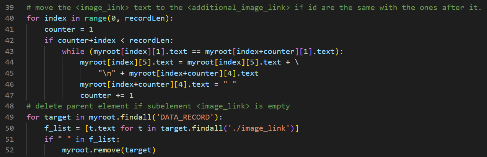
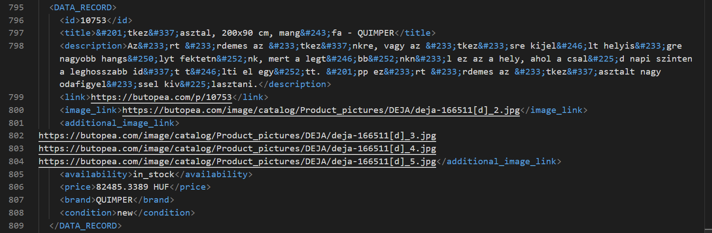

<p style="font-size:15px" align="center">
  <a href="#objective">Objective </a> •
  <a href="#Steps">Steps </a>
</p>


# Objective
Create an XML product feed file according to the [Google Merchant product data specifications](https://support.google.com/merchants/answer/7052112) from an SQLite file-based database.

The output must contain these fields in it:
- ID [id]
- Title [title]
- Description [description]
- Link [link]
- Image link [image_link]
- Additional image link [additional_image_link]
- Availability [availability]
- Price [price]
- Brand [brand]
- Condition [condition]

To break down the problem:
1. Export the query in `.xml` format from the SQLite file.
2. Make verification on it according to Google product data specifications.
3. Export it in `feed.xml`.

# Steps
## Export the query
Opened the SQLite file in [DBeaver](https://dbeaver.io/download/), join the 4 tables in the database and run query to get the result from it.

```sql
select p.product_id as 'id', pd.name as 'title', pd.description as 'description',p.product_id as 'link',
	   pi.image as 'image_link', p.price , m.name as 'brand' from product as p
join product_description pd on p.product_id =pd.product_id 
join product_image pi on p.product_id =pi.product_id 
JOIN manufacturer m on p.manufacturer_id = m.manufacturer_id 
where p.status = "1";
for xml path ('Products')
```

Dbeaver won't output the result as XML file so I had to export the data as XML file, then change root element with 'Products' (I don't know why Dbeaver didn't make it as 'Products but instead, replaced it with the query as tag name').

The exported file doesn't contain `{additional_image_link, availability, condition}` as they are made in the `modify.py`

## Deal with the data
1. Need to add the missing fields to their right place with `addElement(whatToAdd, underWhat, value)`.

2. Add the base domain to product image `(image_link)` and `(additional_image_link)`, also (HUF) at the end of price.

3. Make only one ID to have `Image_link` and append `Image_link` from other ones (that have same ID) to the first one as `additional_image_link` (line 43 to 45)
> Additional images must be loaded in their respective sort orders.

<center>

</center>

As the ID is the only way to tell difference between the parent element for each `additional_image_link` and it is also duplicated, if `ID` is the same with the one after it, then the `additional_image_link` for current one will add the value of `Image_link` in the one after it to its current value and make it white space.

In order not to have duplication, then remove any parent element if the `image_link` child element of it contains white space.

4. compare the IDs to check for duplication (show in console if any found).

5. Check format according to Google product data specifications.

6. Export data in `feed.xml` file

Here is the final result
<center>

</center>

# Not the bright side

The thing that took most of time is the additional image link part, I thought about storing all of them in dictionary with key being their index, then compare them to each other, but it won't be memory wise.

Part of the process was only comparing with one index after it, but this wouldn't work if there are 2+ IDs. 

